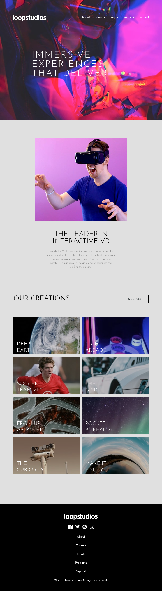
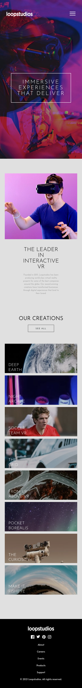
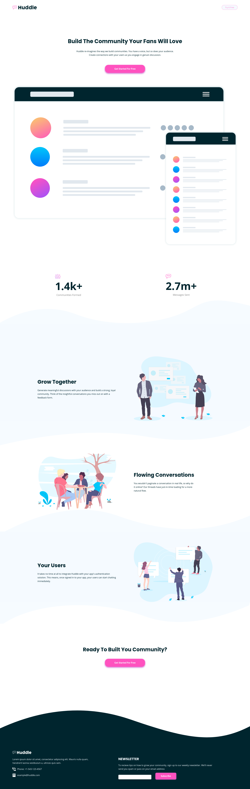
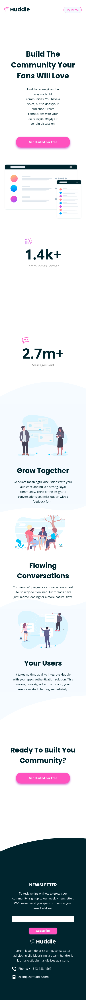

# Front-end exercises
In this repository you will find front end exercises done in HTML5, CSS3 and JavaScript (ES6). Below you will see interfaces with features commonly used in the vast majority of sites.

## Learn to Code 📚
[Click here](https://github.com/vitormrts/front-end-exercises/tree/master/projects/01-learn-to-code) to see the code of this application.

\

\

## Natus Vincere 🎮
[Click here](https://github.com/vitormrts/front-end-exercises/tree/master/projects/02-natus-vincere) to see the code of this application.

\

\

## Loopstudios 👓
[Click here](https://github.com/vitormrts/front-end-exercises/tree/master/projects/03-loop-studios) to see the code of this application.

\

\

## Huddle 📨
[Click here](https://github.com/vitormrts/front-end-exercises/tree/master/projects/04-huddle) to see the code of this application.

\

